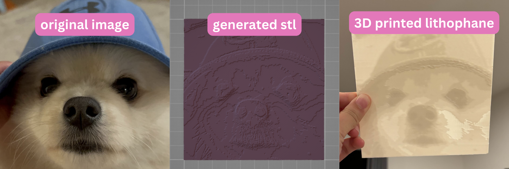

# Image to Lithophane STL Generator



This Python script converts a grayscale image into an STL file for 3D printing as a lithophane. A lithophane is an embossed, translucent image that is visible when illuminated from behind. The script creates a 3D model with varying thickness based on the brightness of the pixels in the image.

## ⭐ Features
- Converts any image into a 3D lithophane STL.
- Adjusts the model’s thickness based on brightness (lighter areas are thinner, darker areas are thicker).
- Allows scaling and reducing the resolution of the image for optimized 3D printing.
- Configurable parameters for lithophane size, thickness, and detail level.
- Outputs STL files ready for 3D printing in millimeters.

## 🚧 Requirements

Ensure you have Python 3.x installed and the following Python libraries:

```bash
pip install numpy opencv-python scikit-image numpy-stl
```

## 🔍 Usage
1. Clone the repository:
```bash
git clone https://github.com/jinc77/lithophane.git
cd lithophane
```

2. Run the script:
```bash
python lithophane.py
```

## 💻 Parameters
In the `create_lithophane` function, you can adjust several parameters:
- `image_path`: The path to the input image (preferably a grayscale image).
- `output_stl_path`: The path where the STL file will be saved.
- `scale`: Scales the lithophane dimensions. Default is 0.5 (1 unit = 0.5 mm).
- `layer_height`: Defines the height of each discrete lithophane layer. Default is 0.2 mm.
- `num_levels`: Sets the number of brightness levels (default is 10).
- `reduction_factor`: Scales down the image resolution for simpler, faster prints. Default is 0.2 for a 20% size reduction.

## 💾 Example
```python
# Example usage in lithophane.py
image_path = 'person.jpg'
output_stl_path = 'lithophane.stl'
create_lithophane(image_path, output_stl_path)
```

This will read `person.jpg` from your project folder and output an STL file named `lithophane.stl`.

## 🌐 Sample Image to STL
You can convert any grayscale image (or convert color images to grayscale using an image editor) into a lithophane. The output STL can then be 3D printed with any FDM or resin printer.

## 🧮 3D Printing Recommendations
- Print Orientation: Always print lithophanes vertically to maximize detail.
- Material: Translucent filaments like white or clear PLA work best for lithophanes.
- Layer Height: Use a layer height of 0.1-0.2 mm for best results.
- Infill: Higher infill percentages (around 100%) will provide better light diffusion through the lithophane.

## 🧠 License
This project is licensed under the MIT License. See the [LICENSE](LICENSE) file for details.

## 📝 Contributing
Feel free to submit issues or pull requests! Contributions are welcome.

## ❤️ Acknowledgements
- Uses the `numpy-stl` library for generating STL files.
- OpenCV and scikit-image for image processing.
